# GIT Lab

1. Instalación de los paquetes de dependecia del proyecto **(npm install)**
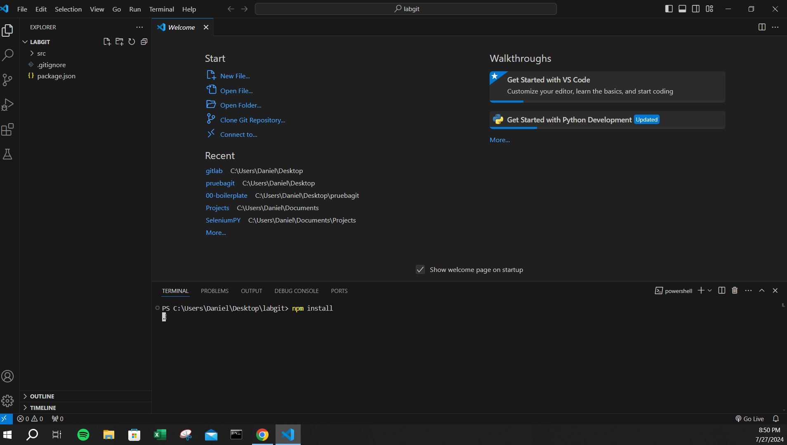

2. Iniciando el script **(npm start)**
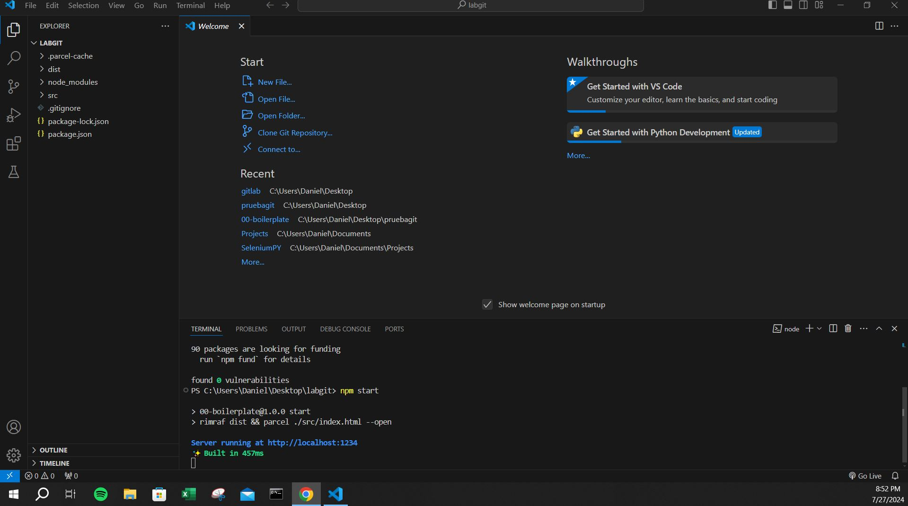

3. Iniciando el repositorio **(git init)**
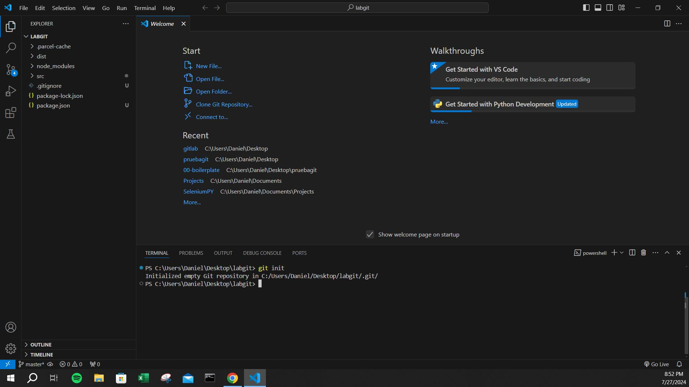

4. Pasando todo a staging **(git add .)**
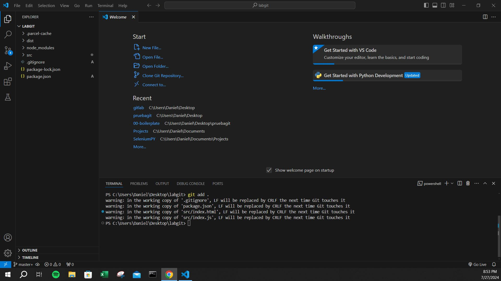

5. Haciendo el primer commit **(git commit)**
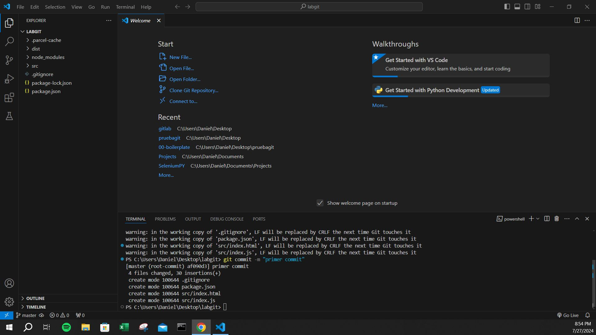

6. Ya creado el repositorio en GitHub, copio la URL del mismo para hacer la conexión local-remoto **(git remote add origin)**
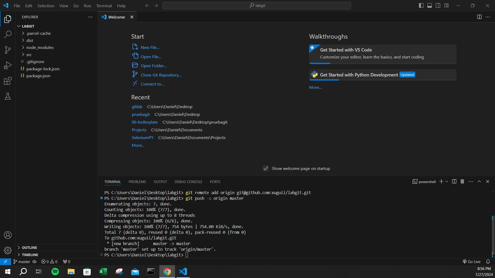

7. Hago un cambio en el archivo index.js, lo paso a staging y hago commit con un mensaje descriptivo **(git commit -m "cambio en el console.log")**
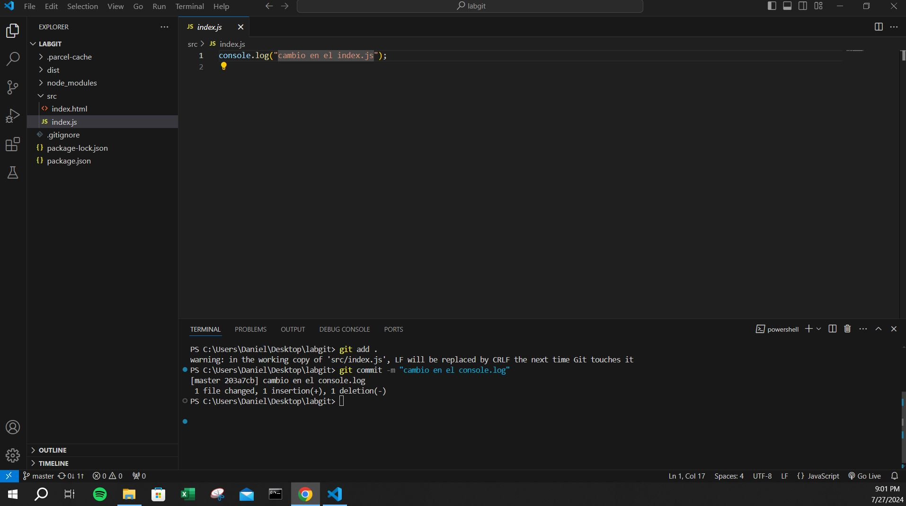

8. Hago el push para subir los cambios al repositorio de GitHub **(git push)**
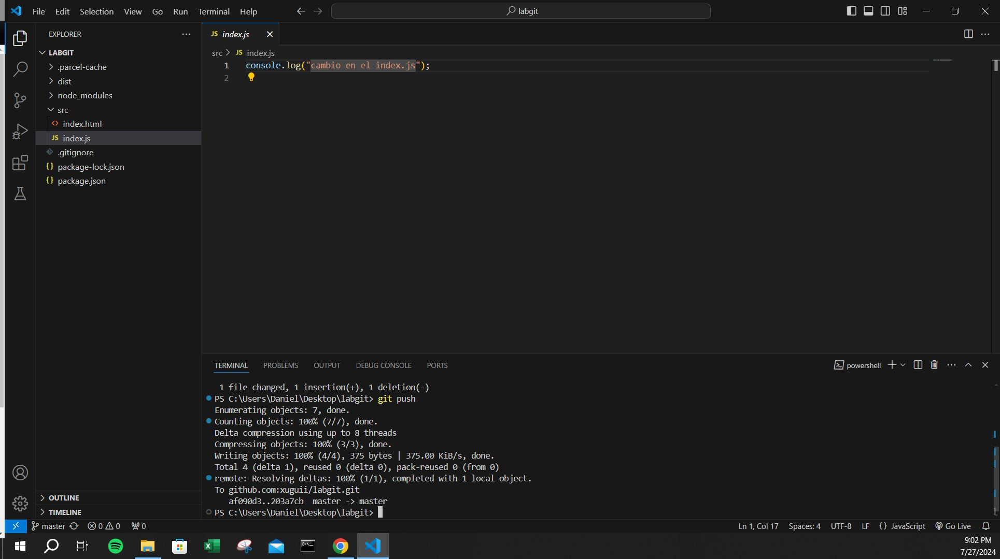

9. Cración de una nueva rama llamada "development" **(git branch development)**
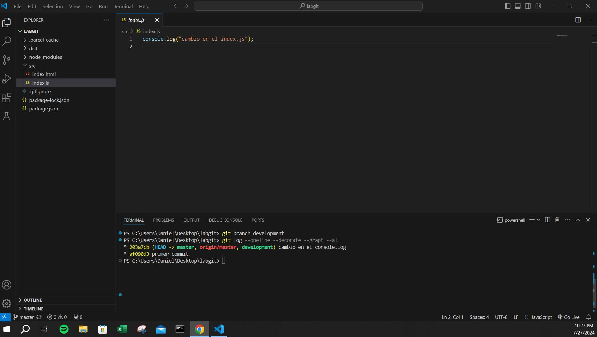

10. Me cambio a la rama "development" y hago un cambio en el archivo index.html, lo paso a staging y hago commit **(git checkout development)**
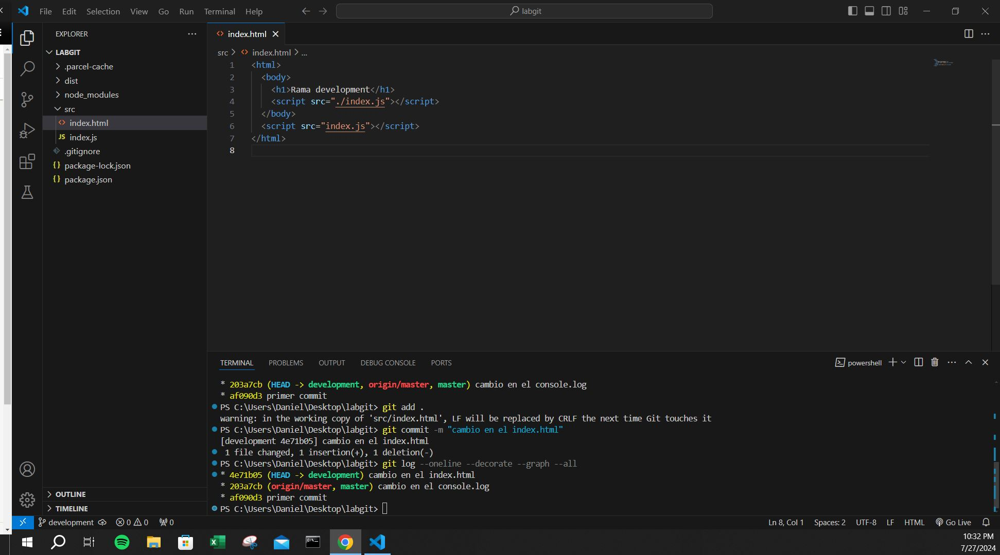

11. Utilizo el comando de log para ver la bifurcación de las ramas **(git log --oneline --decorate --graph --all)**
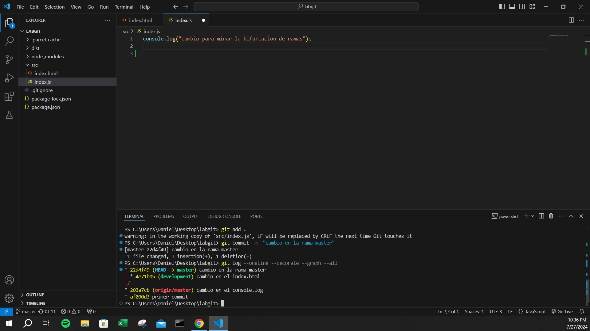

12. Hago el push de la nueva rama "development" con los cambios a GitHub **(git push -f origin development)**
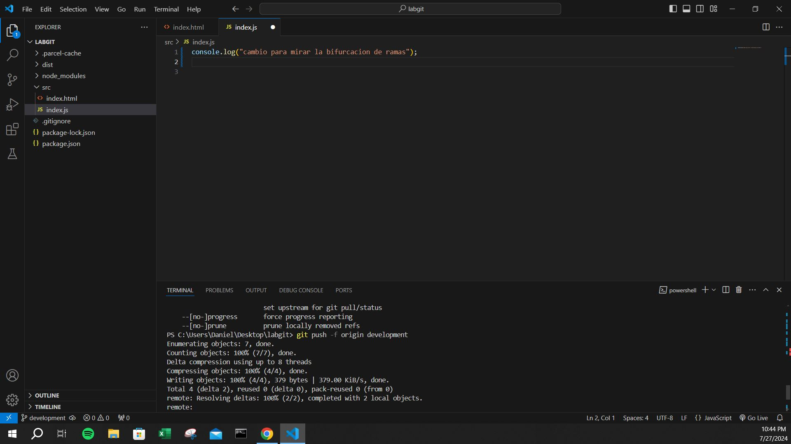

13. Cambiado a la rama master, hago el merge de la rama "development" a la rama master **(git merge development -m "merge de rama development a master)**
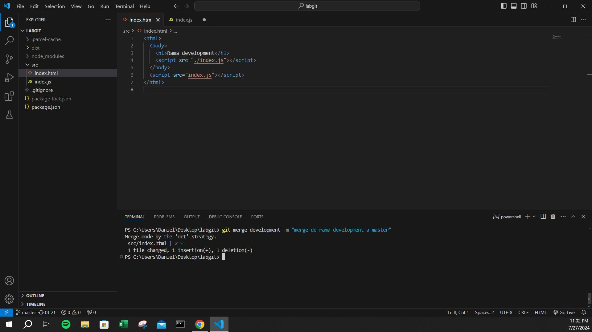

14.  Hago el push **(git push)**
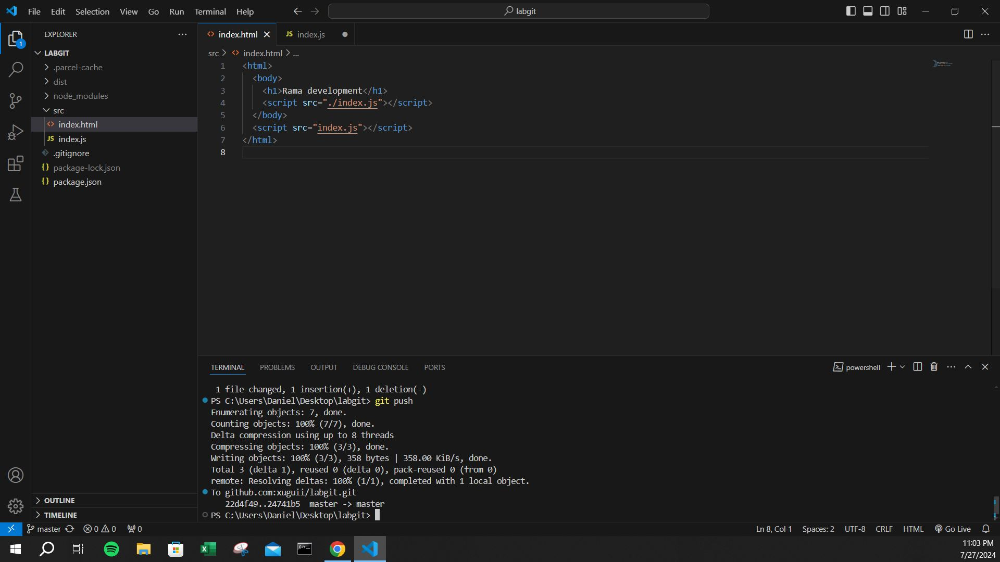

15.  Vuelvo a utilizar el comando de log para visualizar la rama tras el merge **(git log --oneline --decorate --graph --all)**
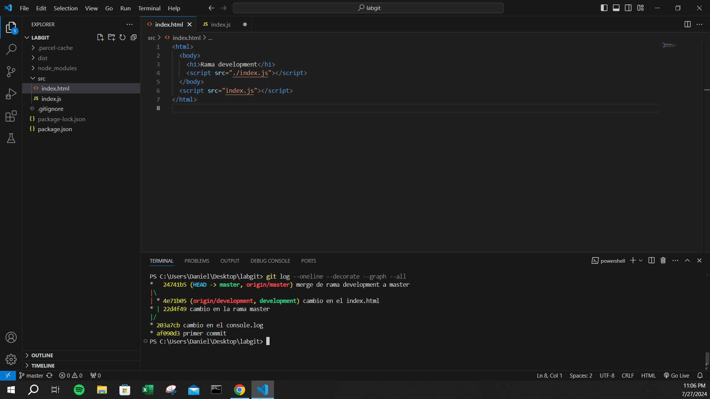

